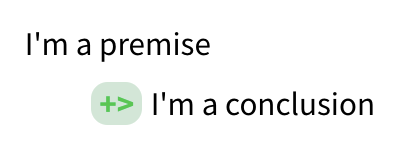
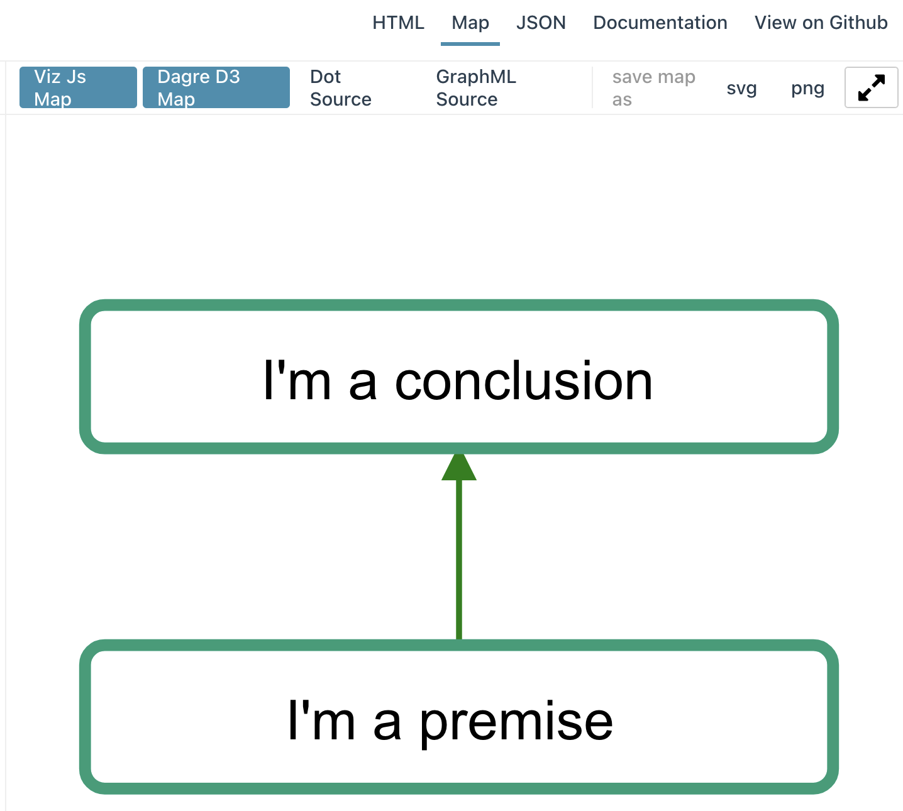
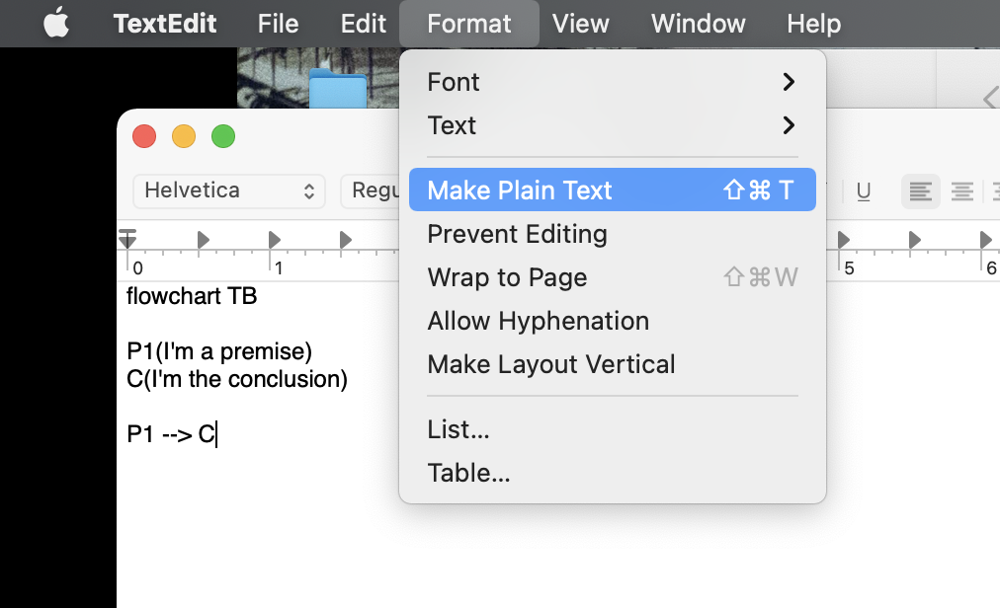
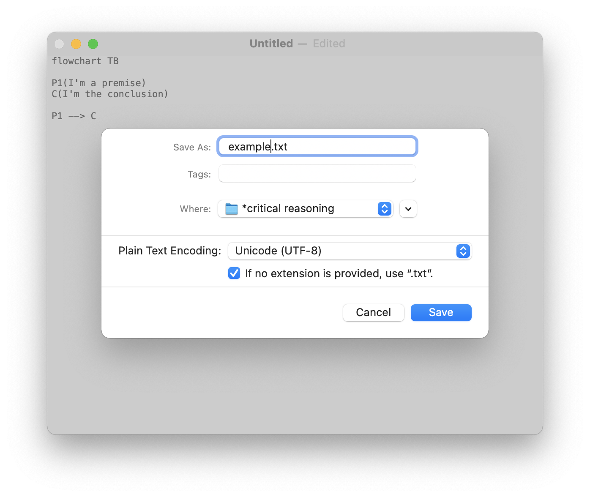
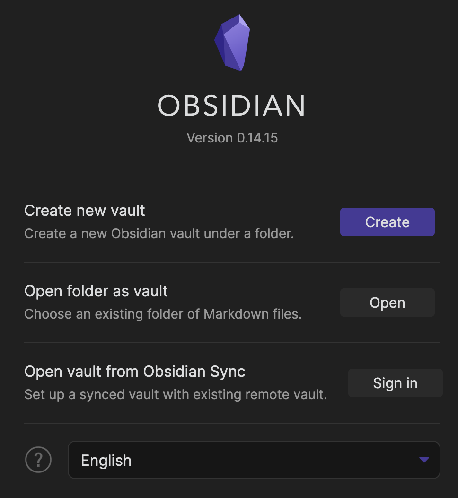
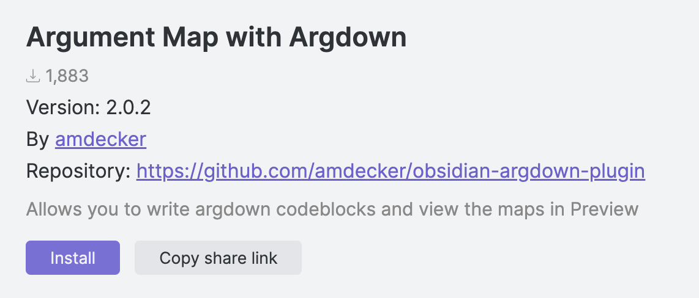
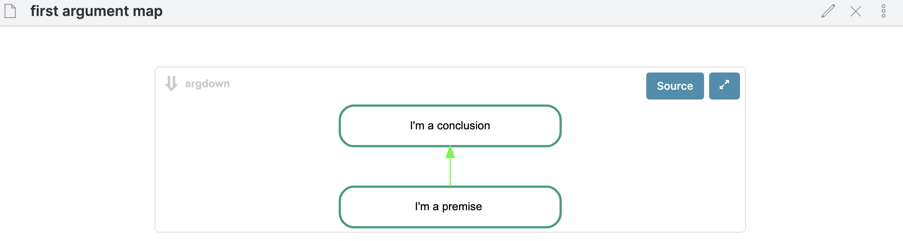

# Setting up Argdown 

Argdown is software designed to turn pieces of text into argument maps, visual representations of the structure of an argument or debate.  This page has instructions for two ways of setting up this software:  you can use a website called the Argdown Sandbox, or you can download and install Argdown on your computer, along with notetaking software called Obsidian.  

Both options for using Argdown are completely free, and either one will work to generate argument maps for this course.  The [Argdown Sandbox](#using-the-argdown-sandbox) doesn't require any setup — you just open up a website and start typing — but doesn't have a simple way to save your work.  Using [Argdown with Obsidian](#using-argdown-with-obsidian) requires you to download and install some software on your computer.  It's easy to use Obsidian to save your argument maps; but the software hasn't been vetted by our campus IT office.  That means there's a security risk installing this software.  **Do not store any sensitive information in Obsidian.**  

## Using the Argdown Sandbox

Using the *Argdown Sandbox* is simple:  simply open a web browser to <https://argdown.org/sandbox/>, and you should see the same thing as @fig-sandbox.  Since you'll be creating argument maps pretty regularly in this class, you'll probably want to bookmark that link.  

{#fig-sandbox}

Most of the Sandbox is taken up by the text pane (left) and preview pane (right).  Notice that you can't click or do anything in the preview pane.  But click anywhere in the text pane, hit ⌘+a (Control+a on Windows) to select all, then hit backspace or delete to clear out the demo text.  Type the following, including at least two spaces or a tab at the start of the second line:  

```
I'm a premise 
  +> I'm a conclusion
```

At the very top-right, there's a list of rendering options (methods for representing the text in the text pane):  HTML, Map, and JSON, then two outgoing links for Documentation (the Argdown homepage) and the Argdown source code on GitHub.  

If you're in HTML mode, you should see something like @fig-sandbox-html in the preview pane.  

{#fig-sandbox-html}

To view the argument map itself, select Map mode in the upper-right, then click Dagre D3 Map at the top of the preview pane.  The whole thing should look like @fig-sandbox-map.  

{#fig-sandbox-map}

### How your computer is organized

If you use your computer primarily through free-text search boxes — just type in a word or phrase and scroll through the results — you might not be used to thinking about how your computer is actually organized.  One side effect of Argdown is that you'll need to be deliberate about where your save your argument maps.  

Your computer is organized like a physical filing cabinet, with drawers containing folders containing (paper) files.  (Except the drawers are also called folders, and you can have folders inside of folders inside of folders inside of folders.)  Every file on your computer lives in its particular folder, and everything containing files is a folder.  This includes your desktop, which is a representation of a special folder tied to your user account on your computer.  Apps are also collections of files organized together into folders; installing an app means copying that folder structure into certain places on your device and configuring the operating system to interact with the app's files.  All computers are organized like this, including your phone, a smartwatch, an Alexa or Siri, a Ring doorbell, etc.  

@fig-folders shows you how I keep all the different files for our class organized into a collection of folders, as viewed using Mac OS's Finder app in column mode.  (Windows has a similar app called File Explorer.)  The `Teaching` folder contains everything related to all of the classes I've taught, past and present.  `critical reasoning` is dedicated to this specific class, with separate folders for each year.  Inside I have further folders, for things like quizzes, the syllabus, writing assignments, and final grades.  The `slides` folder contains all of the lecture slides.  At the bottom of the window, I have Finder configured to show the path, or the location of the particular folder or file being highlighted.  The path starts with my laptop's hard drive (this might look like `C:` on Windows), then the `Users` folder.  The `Users` folder contains files specific to each account on this computer.  There's only one user account on my laptop, `danhicks`, but some systems — like our campus email server — will have thousands of user accounts.  Imagine how many user folders must be in the Gmail and Facebook servers.  

{#fig-folders}

Inside my user folder, `danhicks`, is a specific folder that I sync to the cloud using `Google Drive`.  All of my teaching files are contained in this folder, so that they're synced automatically.  I also backup my files to an external hard drive using the Mac app Time Machine, plus the cloud service Backblaze.  Triple protection in case something happens to my computer!  (The "cloud" is really just physical computers located somewhere else, usually in giant warehouse-like buildings near cheap sources of electricity.)  

Thanks to fast search software, we've gotten used to not having to interact with files and folder organization directly in a lot of cases.  I don't need to know exactly where a certain form is located on the campus website; a web search will turn it up in a few seconds.  But deliberately organizing your own files into folders is important.  For one thing, it makes it much easier to find related files, especially files with similar names or content.  I've taught a lot of classes over the last 15+ years.  So if I'm looking for the syllabus for the Fall 2020 version of Critical Reasoning, a search for `syllabus` is going to turn up a lot of results.  It's much faster to go to the folder for Critical Reasoning, then Fall 2020, and then the syllabus folder.  Then, if I'm looking at that syllabus and want to look up the writing assignment I used in that course, I don't need to remember exactly what I called the writing assignment file or what keywords might bring it up.  I just click a couple of times to open the folder for the writing assignment.  

There's also a technical reason for not leaving all of your files on your desktop.  Your computer assumes that files on your desktop are important and frequently accessed.  So it keeps a kind of pre-loaded copy of the file in memory, so that it can open the file quickly whenever you might need it.  Having hundreds or even thousands of files on your desktop can seriously slow down your computer.  


### Saving your work in the Argdown Sandbox

**The Argdown Sandbox has no way to save your work.**  It's meant to be a quick preview of what Argdown can do, not a space for you to regularly do important work.  You'll need to manually save your work by copying and pasting to a file on your computer.  

*Before you save your work for the first time*, create a designated folder for all of the work for this course.  I'm going to call this **the course folder**.  The Documents folder on your computer is a good place to do this.  If you don't know how to find your Documents folder and create a new folder there, your instructor and TA can help.  

Once you've created the course folder, follow these steps to save a new argument map.  Try them out with the example you typed in to the text pane a few minutes ago.  

1. Open the app TextEdit (on a Mac) or Notepad (on Windows).^[You can use any plaintext editor of your choice.  But something like Microsoft Word or Google Docs *won't* work.]
2. Create a new file, and copy and paste the argument map text from the Argdown Sandbox into the new file. 
3. *On a Mac*: You may need to go to Format -> Make Plain Text.  See @fig-plaintext. 

	{#fig-plaintext} 

4. Hit ⌘+s (Mac) or Control+s (Windows) to bring up the save dialog.  
	- **Make sure you're saving to the course folder.**
	- **Make sure the file type is set to "plain text" or "txt".**  
	{#fig-save}

When you want to open up a saved argument map, you'll need to follow these steps. 

1. Find the argument map file in the course folder, and open it with your text editor.  
2. Select the entire argument map text, then copy it. 
3. Open the Argdown Sandbox by navigating a web browser to <https://argdown.org/sandbox/>. 
3. Select the example text in the text pane, then paste the argument map text. 

### Saving an image file from the Argdown Sandbox 

After creating an argument map in the Argdown Sandbox, you can download an image file by clicking on png near the upper-right.  Hit "Create PNG" in the dialog box, and you'll automatically download an image file named `map.png`.  **Move this to the course folder, and give it the same name as the corresponding text file.**  


## Using Argdown with Obsidian

[Obsidian](https://obsidian.md/) is notetaking and [knowledge base](https://en.wikipedia.org/wiki/Knowledge_base) software.  If you've used the website Notion, it's somewhat similar.  We can use Obsidian with Argdown using a community-developed plugin.  Both Obsidian and the Argdown plugin are entirely free.  Creating argument maps is just a little more complicated than using the Argdown Sandbox, but as an app on your computer it's simple to save and open argument maps.  

**If you're going with this option, remember that OIT has not vetted Obsidian for security and privacy.  Be sure not to store any sensitive information in Obsidian.**

### Installing Obsidian and the Argdown plugin

To setup and install Obsidian and the Argdown plugin, follow these steps:  

1. Navigate a web browser to <https://obsidian.md/> and click the download link for your operating system.  After the download finishes, run the installer.  
2. Open Obsidian.  It should show you the "open vault" window in @fig-obsidian. 
	- If you already created [a course folder](#saving-your-work-in-the-argdown-sandbox), choose "Open folder as vault," and select your course folder as an Obsidian vault.  This won't mess up your existing files in any way; Obsidian plays nicely with other apps.  
	- If you haven't already created a course folder, choose "Create new vault."  Give your vault/course folder a name like "Critical Reasoning" and set its location to be something like your Documents folder.  
	
	{#fig-obsidian}

2. Navigate a browser to <https://obsidian.md/plugins?search=argdown>.  (Or, from the Obsidian homepage, click "Plugins" and then type `argdown` into the search box.)  Click the "Open in Obsidian" link.  You might need to tell your web browser to use Obsidian for the link.  
3. Obsidian should open and display information about the plugin.  See @fig-obsidian-argdown.  Click "Install." 

	{#fig-obsidian-argdown}

4. After installation, in Obsidian, click on the gear icon (lower-left) to open Settings.  Look for Community Plugins on the left, then the "Installed plugins" section in the main pane.  Find the Argdown plugin and click the toggle to activate it.  

### Creating an argument map in Obsidian

Once the Argdown plugin is installed and activated, you can add an argument map to any Obsidian note.  Your first time through, follow these steps.  

1. Create a new note (you can click the "New Note" icon on the upper-left, or hit ⌘+n on a Mac or Control-N on Windows).  
2. (Optional) Give the note a name, like "first argument map."  Obsidian automatically saves any changes to your files.  
3. Type the following: 

	````
	```argdown
	I'm a premise 
	   +> I'm a conclusion
	```
	````

4. Click on the glasses icon in the upper-right to switch Obsidian into reading mode.  This will prompt the Argdown plugin to render the argument map, turning it into an interactive widget like the Argdown Sandbox.  See @fig-obsidian-map.  If you see text instead of the map, click the "Map" button.  

	{#fig-obsidian-map}

**Important:** In the rest of this tutorial, I won't include the \`\`\``argdown` line at the top or the \`\`\` at the end.  You need to use these special symbols (called *code fencing*) to tell Obsidian that it needs to run the argument map through Argdown.  

### Saving an argument map as a PDF file

Obsidian doesn't have a built-in way to generate image files or Word docx files.  (I haven't tested it, but it looks like the plugin [Obsidian Pandoc](obsidian://show-plugin?id=obsidian-pandoc) can do this for you.)  But it can generate PDF files, which will work just fine for our class.  

To export a note as PDF, click on the three dots icon (upper right) to open the More Options menu.  Export to PDF is at the bottom.  After clicking the Export to PDF button, a save dialog will pop up.  I recommend saving it in the same folder as the argument map itself, so that you can always find them together.  

### Doing more with Obsidian

For this class, this is pretty much all you need to know about Obsidian.  But it's much more powerful:  you can add formatting (including emphasis, bold, headings, lists), insert images and links, and visualize a folder of notes as a network, without adding any other plugins.  There are lots of tutorials for Obsidian online.  

