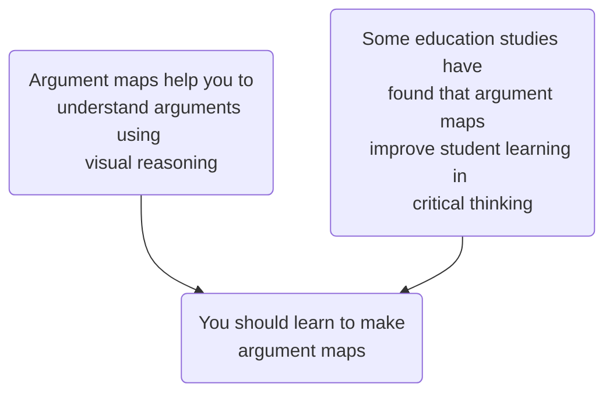

# Introduction 

Argument maps are visual representations of arguments and debates, showing how claims support or challenge other claims.  Here's a map of an argument that you should learn how to make argument maps. 

In @sec-setup we'll get set up to create argument maps using free software.  @sec-simple gets us started actually creating simple maps.  Then @sec-interdependent we'll learn how to map arguments with interdependent premises — sets of premises that work together to support a conclusion.  To map **debates** — in which [interlocutors](https://en.wiktionary.org/wiki/interlocutor#Noun) exchange objections and replies — we'll need to indicate when a claim challenges another claim.  We'll learn how to do this in @sec-objections, looking specifically at one corner of the debate over abortion.  Finally, @sec-biofuels walks through a complex debate over switching fossil fuel refineries to biodiesel production.  We'll see how argument maps help clarify how a rapid exchange of claims, objections, and replies all relate to each other.  

Parts of this tutorial use examples from Maralee Harrell, *What is the Argument?*, MIT Press, 2016, chapter 3, and David Morrow and Anthony Weston, *A Workbook for Arguments*, third edition, Hackett Publishing, 2019. 

Thanks to [Cédric Eyssette](https://twitter.com/Cedric_Eyssette/status/1544599827035602944) for suggesting Mermaid.  